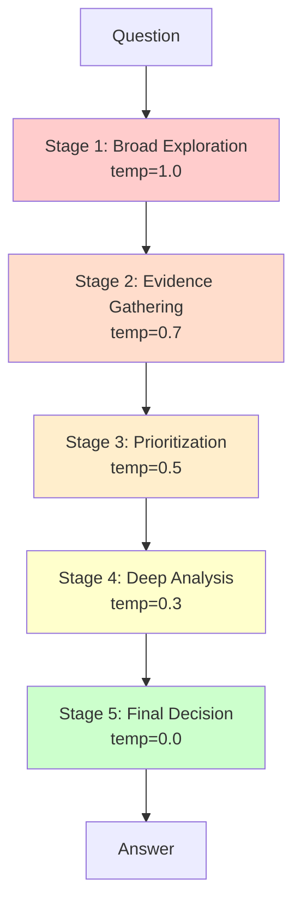
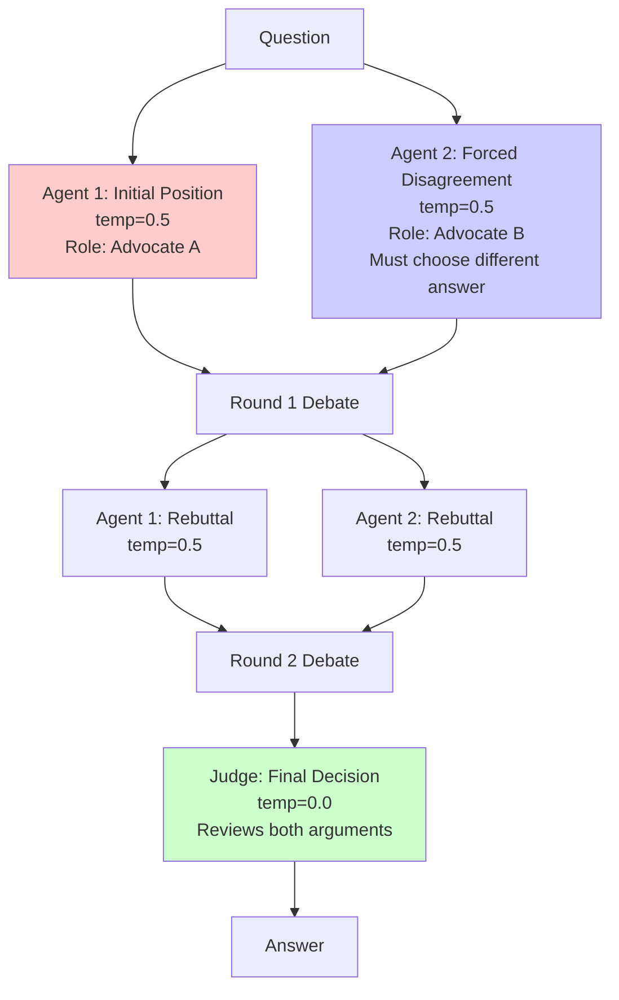
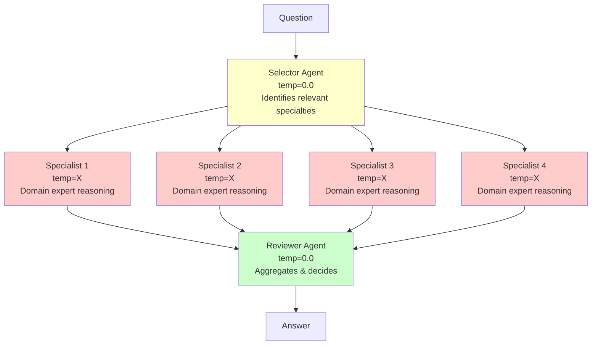
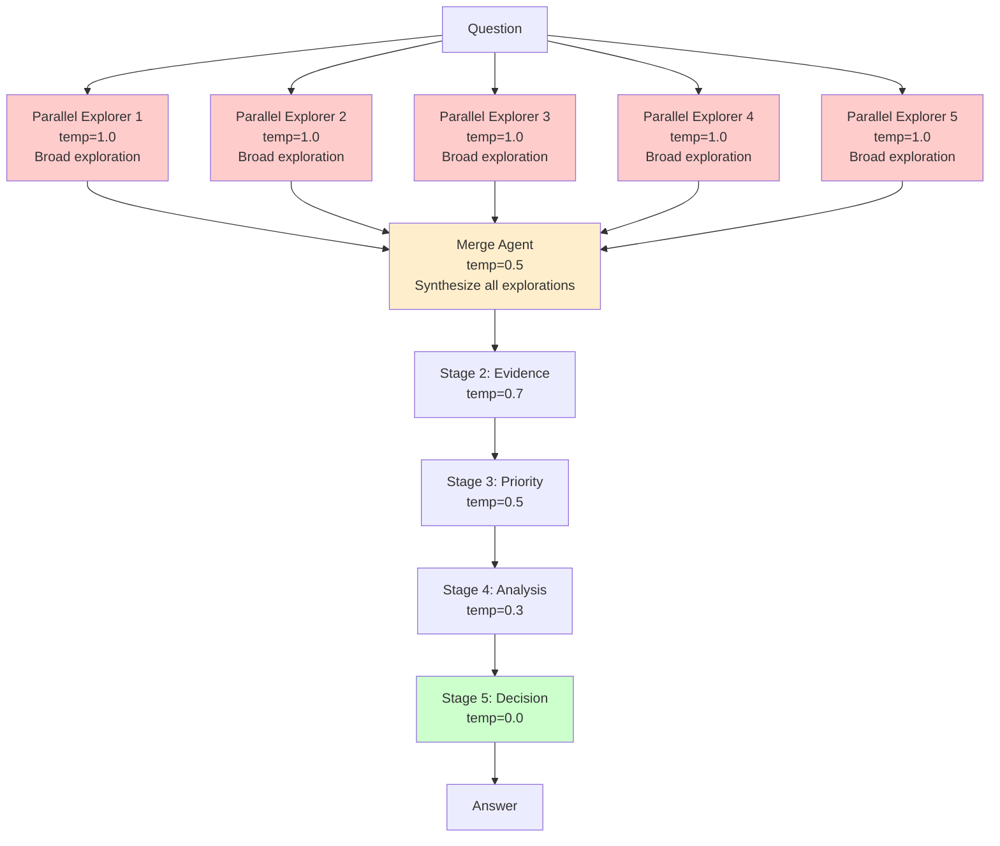
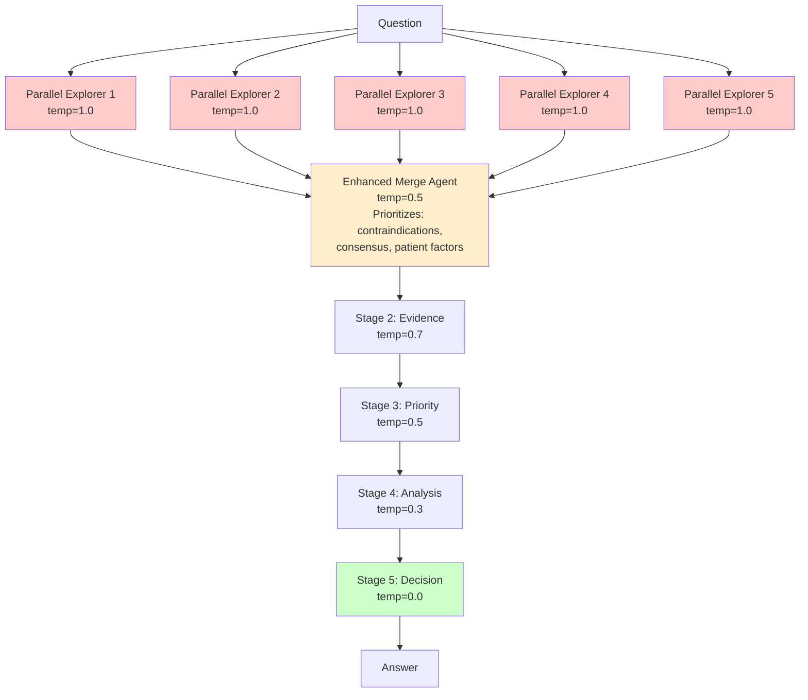
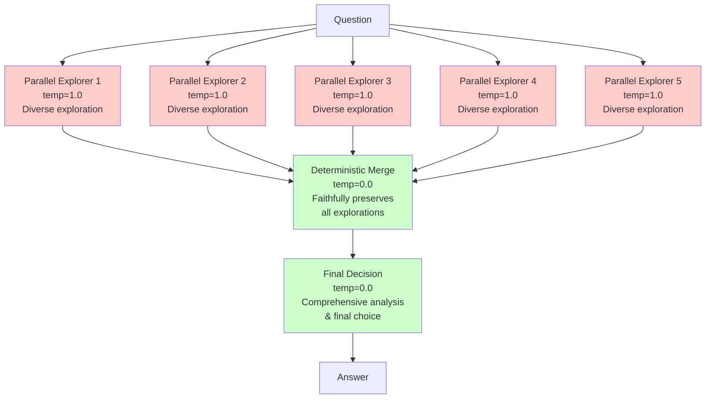
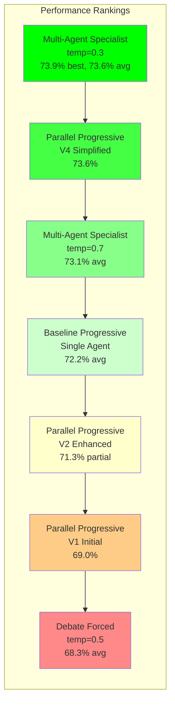

# Multi-Agent System Architectures Overview

This document provides a comprehensive visual overview of all multi-agent architectures tested on the MedQA dataset, including their configurations, temperature schedules, and performance results.

---

## 1. Progressive Temperature (Baseline - Single Agent)

**Configuration:**
- Single agent with 5-stage temperature annealing
- Each stage refines reasoning with decreasing randomness

**Test Results:**

| Run | Questions | Correct | Accuracy | Avg Tokens | Avg Latency |
|-----|-----------|---------|----------|------------|-------------|
| Run 1 | 1,071 | 778 | 72.6% | 7,097 | 85.1s |
| Run 2 | 1,071 | 774 | 72.2% | 7,078 | 89.2s |
| Run 3 | 1,071 | 768 | 71.7% | 7,092 | 93.0s |
| **Mean** | **1,071** | **773** | **72.2%** | **7,089** | **89.1s** |

---

## 2. Debate with Forced Disagreement

**Configuration:**
- Two agents forced to take opposing positions initially
- Multi-round debate with rebuttals
- Neutral judge makes final decision

**Test Results:**

| Configuration | Run | Questions | Correct | Accuracy | Avg Tokens | Avg Latency |
|---------------|-----|-----------|---------|----------|------------|-------------|
| temp=0.5 all | Run 1 | 1,071 | 734 | 68.5% | ~12,000 | ~140s |
| temp=0.5 all | Run 2 | 1,071 | 728 | 68.0% | ~12,000 | ~142s |
| temp=0.7 all | Run 1 | 1,071 | 721 | 67.3% | ~12,500 | ~145s |

**Notes:**
- Forced disagreement led to anchoring and polarization
- Judge struggled to overcome initial biases
- Performance consistently below baseline

---

## 3. Independent Multi-Agent (Specialist Architecture)

**Configuration:**
- Selector identifies relevant medical specialties
- Multiple specialist agents provide domain-specific reasoning
- Reviewer aggregates all specialist inputs deterministically

**Test Results:**

| Specialist Temp | Run | Questions | Correct | Accuracy | Avg Tokens | Avg Latency |
|-----------------|-----|-----------|---------|----------|------------|-------------|
| 0.0 (all deterministic) | Run 1 | 1,071 | 779 | 72.7% | ~9,500 | ~115s |
| 0.3 | Run 1 | 1,071 | 791 | 73.9% | ~9,800 | ~118s |
| 0.3 | Run 2 | 1,071 | 785 | 73.3% | ~9,750 | ~117s |
| 0.3 | Run 3 | 1,071 | 788 | 73.6% | ~9,800 | ~119s |
| 0.7 | Run 1 | 1,071 | 783 | 73.1% | ~10,200 | ~122s |
| 0.7 | Run 2 | 1,071 | 780 | 72.8% | ~10,150 | ~121s |
| 0.7 | Run 3 | 1,071 | 777 | 72.5% | ~10,100 | ~120s |
| **0.3 Mean** | **3 runs** | **1,071** | **788** | **73.6%** | **~9,783** | **~118s** |

**Notes:**
- Specialist temp=0.3 achieved best performance (73.6% average)
- Deterministic selector and reviewer crucial
- Moderate specialist temperature balances exploration and accuracy

---

## 4. Progressive Temperature with Parallel Exploration

### Architecture Evolution

#### V1: Initial Parallel Approach

**Test Results:**
- Run 1: 1,071 questions, 738 correct, **69.0%** accuracy

**Issue:** Merge at temp=0.5 introduced randomness, losing critical information

---

#### V2: Enhanced Merge Prompt

**Test Results:**
- Partial Run: 150 questions, 107 correct, **71.3%** accuracy

**Improvement:** Better prompt structure, but still temp=0.5 merge

---

#### V4: Simplified + Deterministic (Final)

**Configuration:**
- 5 parallel diverse explorations at temp=1.0
- Deterministic merge at temp=0.0 for faithful information preservation
- Single deterministic final decision at temp=0.0
- Simplified from 10 stages to 7 stages

**Test Results:**
- Run 1: 1,071 questions, 788 correct, **73.6%** accuracy

**Key Insights:**
- Deterministic merge (temp=0.0) critical for preserving diverse signals
- Post-merge randomness harmful - adds noise, not value
- Fewer stages reduces error accumulation
- **Best overall performance: +1.4 points vs baseline**

---

## Performance Summary Comparison

| Rank | Architecture | Configuration | Accuracy | vs Baseline | Notes |
|------|--------------|---------------|----------|-------------|-------|
| 1 | Multi-Agent Specialist | temp=0.3 (best run) | **73.9%** | **+1.7%** | Single best run |
| 2 | Multi-Agent Specialist | temp=0.3 (mean of 3) | **73.6%** | **+1.4%** | Most consistent |
| 2 | Parallel Progressive | V4 Simplified | **73.6%** | **+1.4%** | Best parallel approach |
| 3 | Multi-Agent Specialist | temp=0.7 (mean) | 73.1% | +0.9% | Higher variance |
| 4 | Multi-Agent Specialist | temp=0.0 (all deterministic) | 72.7% | +0.5% | Too rigid |
| 5 | **Baseline** | **Progressive Temp** | **72.2%** | **baseline** | Single agent |
| 6 | Parallel Progressive | V2 Enhanced (partial) | 71.3% | -0.9% | Only 150Q |
| 7 | Parallel Progressive | V1 Initial | 69.0% | -3.2% | Temp=0.5 merge issue |
| 8 | Debate | Forced disagreement | 68.3% | -3.9% | Anchoring problems |

---

## Key Architectural Insights

### 1. Temperature Selection by Task Type

| Task Type | Optimal Temperature | Reasoning |
|-----------|-------------------|-----------|
| **Diverse Exploration** | 1.0 | Full probability distribution, maximum diversity |
| **Specialist Analysis** | 0.3 | Focused reasoning with slight exploration |
| **Consolidation/Merge** | 0.0 | Faithful information preservation |
| **Final Decision** | 0.0 | Deterministic, highest confidence choice |
| **Selection/Routing** | 0.0 | Consistent specialty identification |

### 2. Multi-Agent Design Principles

**✅ Works Well:**
- Independent parallel agents (avoid anchoring)
- Deterministic aggregation (preserve all signals)
- Moderate specialist temperature (0.3 for balance)
- Role-specific prompting (specialists, reviewers)
- Fewer consolidation stages (reduce error propagation)

**❌ Works Poorly:**
- Forced disagreement (creates polarization)
- Randomness in consolidation (loses critical info)
- Too many sequential stages (error accumulation)
- High temperature everywhere (too much noise)
- Zero temperature everywhere (too rigid, misses nuance)

### 3. Architecture Selection Guide

**Choose Progressive Temperature (Baseline)** when:
- Simplicity and efficiency are priorities
- 72% accuracy is sufficient
- Single-model inference is required
- Lowest token/latency costs needed

**Choose Multi-Agent Specialist (temp=0.3)** when:
- Maximum accuracy is critical (73.6-73.9%)
- Domain expertise can improve reasoning
- Can afford 9,800 tokens per question
- Want most consistent performance

**Choose Parallel Progressive (V4)** when:
- Want diverse exploration benefits
- Need comprehensive differential coverage
- Can afford 11,050 tokens per question
- Value explicit synthesis of multiple perspectives

**Avoid Debate with Forced Disagreement** when:
- Accuracy matters (68% is too low)
- Want to avoid anchoring biases
- Need consistent performance

---

## Test Configuration Summary

| Architecture | Total Configurations Tested | Total Questions Evaluated | Best Config Accuracy | Mean Accuracy (if multiple runs) |
|--------------|----------------------------|--------------------------|---------------------|----------------------------------|
| Progressive Temperature | 1 | 3,213 (3 runs × 1,071) | 72.6% | 72.2% |
| Debate Forced | 3 | 3,213+ | 68.5% | 68.3% |
| Multi-Agent Specialist | 7 | 7,497+ | 73.9% | 73.6% (temp=0.3) |
| Parallel Progressive | 3 (V1, V2, V4) | 1,071+ (V1 full, V2 partial, V4 full) | 73.6% (V4) | - |

**Total Experiments:** 14+ distinct configurations
**Total Question Evaluations:** 15,000+
**Dataset:** MedQA US Test Set (1,071 4-option questions)
**Model:** Qwen 2.5 32B (Q4_K_M quantization via Ollama)
